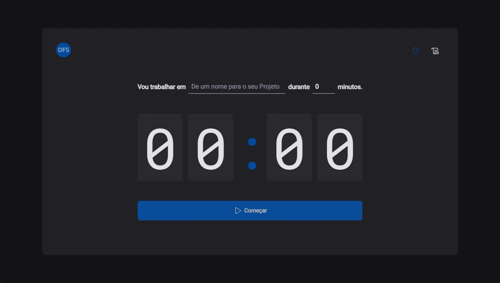

<div align="center">

# Timer OFS


## </div>

## 📋 Menu

- 🖼️ [Imagem do Projeto](#imagem-do-projeto)
- 📖 [Sobre](#sobre)
- 🛠️ [Tecnologias](#tecnologias)
- ⚙️ [Funcionalidades](#funcionalidades)
- 🗂️ [Arquitetura de Dados](#arquitetura-de-dados)
- 📁 [Estrutura do Projeto](#estrutura-do-projeto)
- 🚀 [Configuração](#configuração)
- 🗺️ [Rotas](#rotas)
- 👥 [Contributors](#contributors-or-owners)
- 🤝 [Contribuir](#contribute-to-the-projects-or-owner)
- 📬 [Contact](#contact)
- 📄 [License](#license)

## Imagem do Projeto



## Sobre

Aplicação de timer estilo Pomodoro. Permite criar ciclos de foco com tarefa e duração personalizadas, acompanhar a contagem regressiva em tempo real e consultar o histórico de ciclos concluídos, interrompidos ou em andamento. O estado da aplicação é persistido automaticamente no `localStorage`, permitindo retomar os dados entre sessões.

©créditos [Rocketseat](https://www.rocketseat.com.br/)

| Item                | Detalhe                                                          |
| ------------------- | ---------------------------------------------------------------- |
| Tipo de repositório | Monólito                                                         |
| Estrutura           | SPA React com Vite, roteamento client-side e estado global local |

Desenvolvido por **Emmanuel Oliveira**.

## Tecnologias

| Tecnologia        | Versão | Descrição                                           |
| ----------------- | ------ | --------------------------------------------------- |
| React             | 19.2.0 | Biblioteca para construção da interface             |
| TypeScript        | 5.9.3  | Tipagem estática e segurança no desenvolvimento     |
| Vite (Rolldown)   | 7.2.5  | Bundler e servidor de desenvolvimento com HMR       |
| Styled Components | 6.1.19 | Estilização com CSS-in-JS e temas                   |
| React Router DOM  | 7.10.1 | Roteamento entre páginas Home e Histórico           |
| React Hook Form   | 7.69.0 | Gerenciamento e validação de formulários            |
| Zod               | 4.2.1  | Schema de validação do formulário de novo ciclo     |
| Immer             | 11.1.8 | Imutabilidade simplificada no reducer de ciclos     |
| date-fns          | 4.1.0  | Cálculo de tempo e formatação de datas no histórico |
| Phosphor React    | 1.4.1  | Ícones da interface (play, stop, timer, histórico)  |
| ESLint            | 9.39.1 | Linting e padronização de código                    |
| pnpm              | 11.6.0 | Gerenciador de pacotes do projeto                   |

## Funcionalidades

- ✅ Criação de ciclos de foco com nome da tarefa e duração (5 a 90 minutos)
- ✅ Contagem regressiva em tempo real com atualização do título da aba
- ✅ Interrupção manual de ciclos em andamento
- ✅ Finalização automática ao atingir o tempo configurado
- ✅ Histórico completo com status (concluído, interrompido, em andamento)
- ✅ Persistência do estado no `localStorage` (`ofs-timer:cyclesState-v1.0`)
- ✅ Validação de formulário com React Hook Form + Zod
- ✅ Tema visual customizado com Styled Components

## Arquitetura de Dados

O fluxo de dados segue o padrão **Context API + useReducer**. O `CyclesContextProvider` centraliza o estado dos ciclos, despacha ações tipadas (`ADD_NEW_CYCLE`, `INTERRUPT_CURRENT_CYCLE`, `MARK_CURRENT_CYCLE_AS_FINISHED`) e sincroniza o estado com o `localStorage` a cada alteração. O reducer utiliza **Immer** para atualizações imutáveis. Não há backend nem API externa — todos os dados ficam no navegador do usuário.

### Componentes Principais

| Componente              | Localização                              | Descrição                                            |
| ----------------------- | ---------------------------------------- | ---------------------------------------------------- |
| `CyclesContextProvider` | `src/context/CycleContext.tsx`           | Provider global de estado e persistência             |
| `cyclesReducer`         | `src/reducers/cycles/reducer.ts`         | Reducer com ações de criar, interromper e finalizar  |
| `Home`                  | `src/pages/home/index.tsx`               | Página principal com formulário e controles do timer |
| `NewCycleForm`          | `src/pages/home/components/NewCycleForm` | Formulário de tarefa e duração do ciclo              |
| `Countdown`             | `src/pages/home/components/Countdown`    | Contagem regressiva e finalização automática         |
| `History`               | `src/pages/history/index.tsx`            | Tabela com histórico de ciclos e status              |
| `Header`                | `src/components/header/index.tsx`        | Navegação entre Timer e Histórico                    |
| `DefaultLayout`         | `src/layouts/default-layout/index.tsx`   | Layout base com header e outlet de rotas             |

## Estrutura do Projeto

```
timer-ofs/
├── src/
│   ├── @types/                   # Tipagens globais (styled-components)
│   ├── assets/                   # Logo e assets estáticos
│   ├── components/
│   │   └── header/               # Cabeçalho com navegação
│   ├── context/
│   │   └── CycleContext.tsx      # Context + reducer + localStorage
│   ├── layouts/
│   │   └── default-layout/       # Layout padrão da aplicação
│   ├── pages/
│   │   ├── home/                 # Timer e formulário de ciclo
│   │   │   └── components/
│   │   │       ├── Countdown/
│   │   │       └── NewCycleForm/
│   │   └── history/              # Histórico de ciclos
│   ├── reducers/
│   │   └── cycles/               # Actions e reducer de ciclos
│   ├── router/
│   │   └── index.tsx             # Definição de rotas
│   ├── styles/
│   │   ├── global.ts             # Estilos globais
│   │   └── themes/theme.ts       # Tema da aplicação
│   ├── App.tsx
│   └── main.tsx
├── index.html
├── package.json
├── pnpm-lock.yaml
├── mise.toml                     # Versão do Node.js (24.12.0)
├── tsconfig.app.json
├── tsconfig.node.json
└── vite.config.ts
```

## Configuração

### Pré-requisitos

- Node.js `>= 24.12.0` (gerenciado via [mise](https://mise.jdx.dev/) — ver `mise.toml`)
- pnpm `>= 10`

### Instalação

```bash
# Clone o repositório
git clone https://github.com/ofs-org/timer-ofs.git

# Entre na pasta do projeto
cd timer-ofs

# Instale as dependências
pnpm install
```

> [!NOTE]
> ℹ️ Este projeto não utiliza variáveis de ambiente. Todos os dados são armazenados localmente no navegador.

### Scripts Disponíveis

| Script          | Comando        | Descrição                                    |
| --------------- | -------------- | -------------------------------------------- |
| Desenvolvimento | `pnpm dev`     | Inicia o servidor Vite com hot reload        |
| Build           | `pnpm build`   | Compila TypeScript e gera build de produção  |
| Preview         | `pnpm preview` | Pré-visualiza o build de produção localmente |
| Lint            | `pnpm lint`    | Executa o ESLint em todo o projeto           |

## Rotas

| Rota       | Descrição                                                |
| ---------- | -------------------------------------------------------- |
| `/`        | Página principal — formulário de ciclo e contagem        |
| `/history` | Histórico de ciclos com tarefa, duração, início e status |

## Contributors or owners


[Emmanuel Oliveira](https://portfolio.ofs.dev.br)

<small>

[developed by 💖Emmanuel Oliveira](https://www.linkedin.com/in/oliveira-emmanuel/)

</small>

<br>

<small> &copy; Todos os Direitos Reservados </small>

## Contribute to the projects or Owner

Clique na seta abaixo e veja como você pode contribuir para o projeto

<details close>

<summary>
Como fazer uma contribuição ao Projeto ?
</summary>
 Familiarize-se com a documentação do projeto, que geralmente inclui guias de instalação.

 <br>

Explore o código do projeto para entender sua estrutura e funcionamento.

<br>

**Faça um Fork**

Crie uma cópia (fork) do repositório original em sua conta do GitHub.

<br>


<a href="https://docs.github.com/pt/pull-requests/collaborating-with-pull-requests/working-with-forks/fork-a-repo"></a>

**Clone o Repositório**

Isso criará uma cópia local do projeto, onde você poderá fazer suas modificações.


<a href="https://docs.github.com/pt/repositories/creating-and-managing-repositories/cloning-a-repository"></a>

**Crie uma Nova Branch:**

Crie uma nova branch para isolar suas alterações.

  <br>

Isso facilita a organização do seu trabalho e a criação de pull requests.

<br>

**Faça as Alterações:**

Crie funcionalidades, mude estilos ou resolva `bugs` que iram contribuir para a melhoria do Projeto.

<br>

**Crie um Pull Request:**

Inclua uma descrição clara das suas alterações e explique como elas resolvem o problema ou melhoram o projeto.<br>

Solicitação: Envie um pull request para o repositório original, solicitando que suas alterações sejam incorporadas ao projeto.

 <br>

**Revise e Responda a Feedback:**

Colabore: Os mantenedores do projeto podem solicitar alterações ou fornecer feedback sobre o seu código.

## </details>

## Contact

[](https://www.linkedin.com/in/oliveira-emmanuel/)
[](https://wa.me/5511968336094)
<a href="mailto:ofs.dev.br@gmail.com"> </a>

## <sub>😁Obrigado por chegar até aqui!<sub>

## License

<br>
Released in 2026 This project is under the **MIT license**<br>

<br>
<div align="center">

<strong>⭐ Se este projeto foi útil para você, considere dar uma estrela!</strong>

</div>
